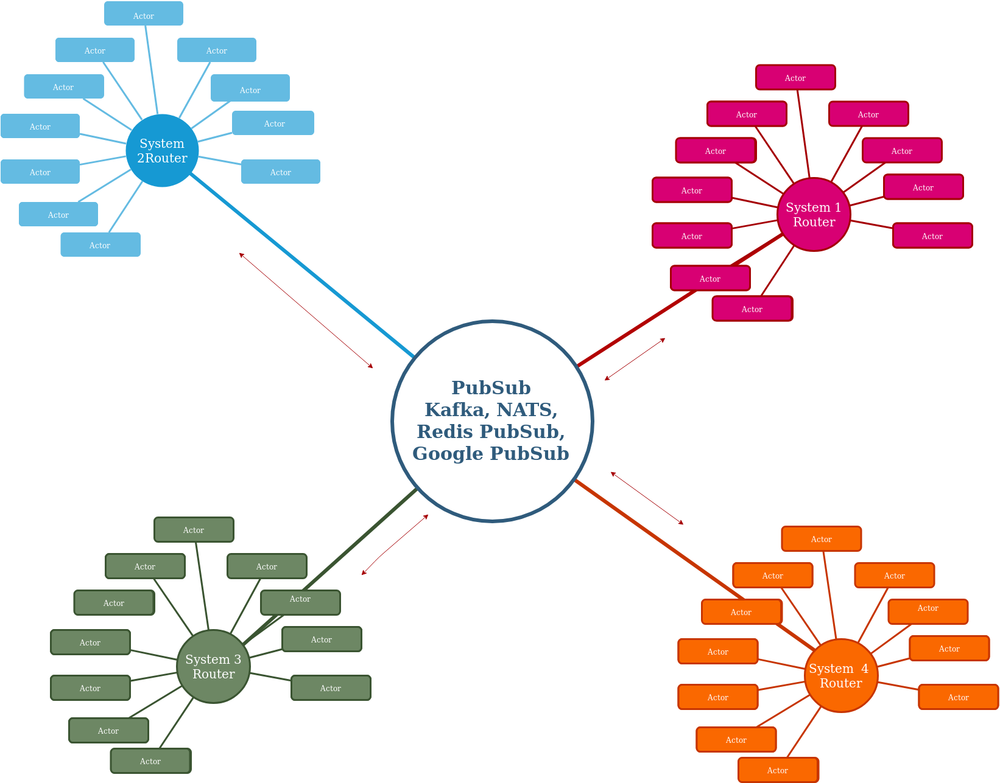

Actorkit
------------
[](https://goreportcard.com/report/github.com/gokit/actorkit)
[](https://travis-ci.org/gokit/actorkit#)

Actorkit is an experiement geared towards the fusion of actor based concurrency programming with different useful software architectural principles to development
a flexible, viable distributable, scalable foundation for building resilient services. 
It takes inspirations from projects like  [Akka](https://akka.io) and [Proto.Actor](http://proto.actor/) and others.

## Install

```bash
go get -u github.com/gokit/actorkit
```

## Architecture



Actorkit is a fusion of CQRS, and actor-based message processing combined within within a
a single library geared towards the creation of scalable, distributed and resilient applications built on the concept of transparent,
addressable processing units. It embraces the very nature of chaotic, failing system which is 
as is natural with distributed systems, allowing the developer to both reason and built handling 
strategies for this issues.
